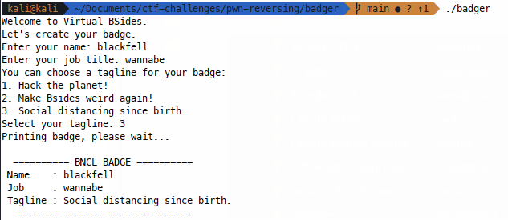
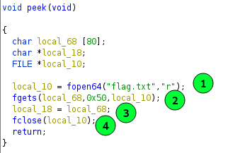

# Challenge Overview

In this challenge, we're given a copy of the *badger* program and an example
flag, but no source code for the program. our task is to exploit this program 
to get the flag. 

# Recon 

## Running the program

We can start by simply running the program in the terminal and observing its 
behaviour:



We can see that we're prompted for some information on our username and job 
title, then for a selection from a tagline list. This information is used to 
print out our 'virtual badge'.

## Basic Reversing

The main functions here disassemble fairly cleanly, but for clarity, we'll hop
into Ghidra and look at some decompilation instead. I'll spoil it for you by
saying that *main()* just calls *vuln()*, so we'll start there instead:


This is a really interesting function! I always start at string inputs, but
we can see that the fgets call for the username is limited to the buffer size (1)
and likewise, the job title is limited to `0x50`, smaller than that buffer (2).
Moving on, we see the taglines are printed out in a while loop (3), before the 
user input via scanf (4) - the format specifier here is *%d*, so we can get an 
integer stored on the stack here.

After this, a function *peek()* is called, before our job and name are printed
to the console (6), finally, the user input from scanf is used to print out the
tagline from the *local_d8* array (7). 

## Finding the Vulnerability

### Final reversing

You may have already spotted the issue here, but we haven't looked at *peek()* 
yet:



We can see this function opens the flag file (1), before reading `0x50` bytes
into a stack buffer (2). A pointer is set to the start of the flag (3) and the
flag file is closed (4). 

### Vulnerability details

You may have already spotted that when the tagline is printed to the console, 
there is no bounds checking of the user input to ensure the index is between 
0 and 2. This means we can leak stack data by specifying an option outside 
the options of 1,2 or 3. 

We also saw that in *peek()*, the flag is placed on the stack, which might have
meant we coudl just select an index that would point to the flag. This is a 
good idea, but *peek()* only briefly 'peeks' at the flag, before returning,
so the stack frame is restroyed, right? Kind of... Only the references to the 
frame are destroyed, so the flag is still there, all we need to do is find
that flag pointer and use its offset from the legitimate array - given this
offset, we can fool the program into printing from this pointer instead of 
from teh legitimate array of taglines. 

# Exploiting the vulnerability

To exploit this issue, we just need to debug the program and run up to the 
printf that gives us our tagline; inspecting the stack at this point, we'll 
be able to find the offset between that and our flag pointer and simply provide 
that as input to our program. 

## Finding the offset

Opening up GDB, we can disassemble *vuln()* to find a good breakpoint:


So our key printf is at `break *(vuln + 358)`, which we can reach by running 
the program on:


where we see the intended stack data (1) at RSP, but examining back to 
`$rsp - 0x80`, we see something suspiciously ASCII like (2) and a pointer to 
that memory address (3), just four full stack addresses below RSP (4). To 
check if this is our flag, we can dereference from the address of the 
suspicious ASCII stuff:


W00t, it's the flag! We can also visualise the pointer to this data really 
nicely, right at the bottom of this output. 

## Exploiting the program

Now we can debug this instruction-by-instruction and work out how to get 
this pointer into printf, but remember that we saw the pointer to our flag was
only four stack addresses away from the intended data at the time of execution.
In theory, all we need to do is subtract 4 from the first option and we should
get the flag printed, let's try it in GDB by supplying `-3` (remember 1 gives 
us the first tagline, `1-4 = -3`). Running up to our breakpoint:


Oh yeah! We used `-3` as our option (1) and now the flag pointer is sat in RDI
(2), ready to be the main argument to printf(3). This will get us the flag. 

## Scripting this up

We can script up an exploit for this super easily:

```python

#!/usr/bin/env python3

from pwn import *

DEBUG = False
REMOTE = False

context.log_level = "DEBUG" if DEBUG else "INFO"

server_string = "127.0.0.1:1337"
host, port = server_string.split(":")
port = int(port)

if REMOTE:
    p = remote(host, port)
else:
    p = process("./badger")
p.recvuntil(b"name:")       # Name prompt
p.sendline("blackfell")
p.recvuntil(b"title:")      # Job prompt
p.sendline("wannabe")
p.recvuntil(b"tagline:")    # Tagline prompt
p.sendline("-3")                # Send the bad index

p.interactive()             # No fancy parsing needed!
```

And we get flag:


Yay! Now it's just a case of firing this remote, adjusting the script as needed. 


# Conclusion

We found a vulnerablity in this program due to a lack of bound checking on an
array index, which we used to print sensitive data from a 'destroyed' stack 
frame from teh *peek()* function. Hoe you enjoyed!

-blackfell
