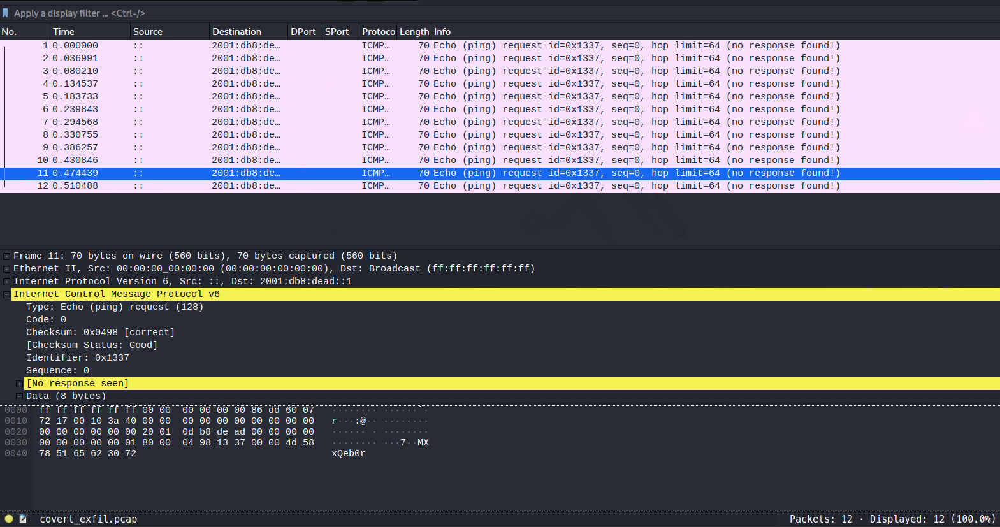
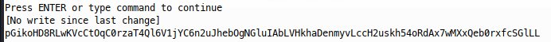
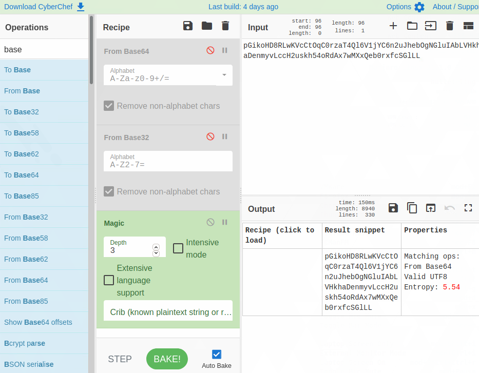
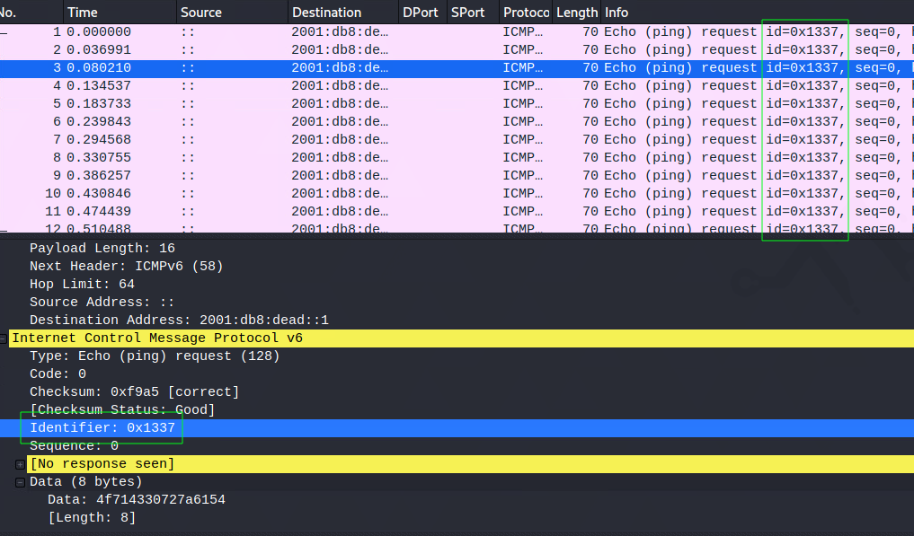
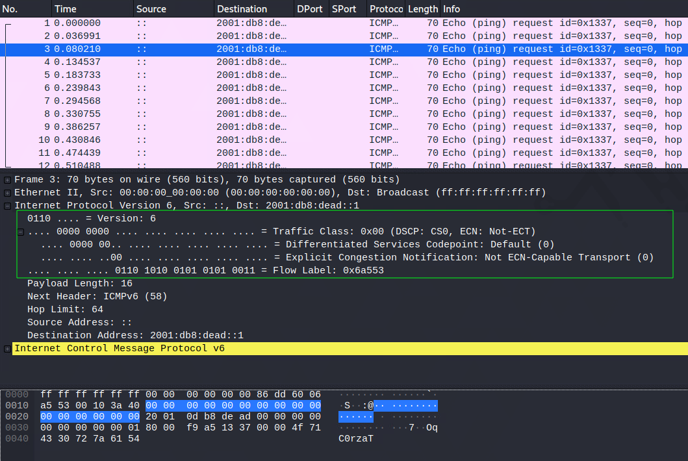
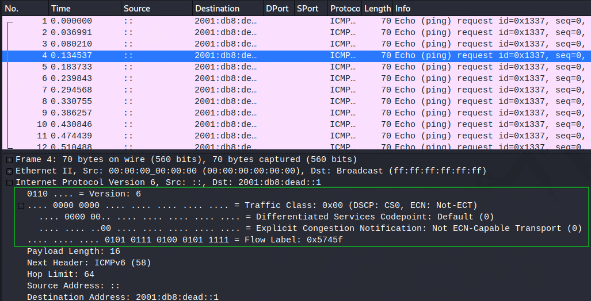
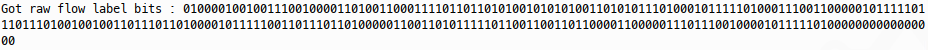
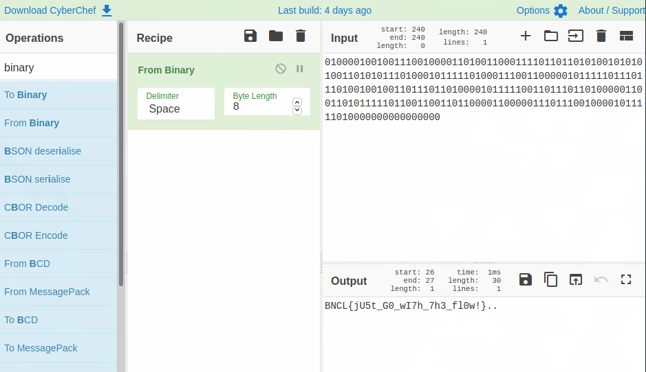

# Challenge Overview

In this challenge, we're given a single PCAP, which we can see (using 
Wireshark) contains just a few packets:



We see that there are a small number of IPv6 packets, which seem to be ICMPv6 
echo requests. Looking at the payloads, we see they're 8 all bytes long. We 
know from the challenge text that there is some data hidden in these packets, 
which we'll need to find to get the flag. 

# Finding the exfiltration method

## Decoding the payload

Since the echo request payloads are 8 bytes, there could be some ASCII or 
encoded data in the payloads. We can try and extract this data and decode it 
by right clicking the payloads in wireshark and copying as printable text, 
or we could use the following scapy script to extract all the payloads:

```python
from scapy.all import *

packets = sniff(offline='covert_exfil.pcap')

for p in packets:
    print(p['ICMPv6EchoRequest'].data.decode(), end="") 
print('') 

```

This gives us a long hex string:



But decoding this using e.g. Cyberchef yields no obvious results.



## Further enumeration

We have no clue as to any potential crypto here and there's not really any
other content that's large enough to store data, there are also no visible 
timing factors that could be encoding data. Before we get stuck into any 
attempt to find complex encoding or encryption of the flag, let's take a look 
through the various fields and headers of the packets and see what, if 
anything is changing. 

We can do this by expanding the packets in wireshark and scrolling through them, 
for example, we can see the echo request ID is static:



Set to the hex value `0x1337`, but like some of the other feilds, this isn't 
changing packet-to-packet. If we jump into the IPv6 layer instead, we can see 
some other fields in the IPv6 header:



Where we have the traffic class, services codepoint, ECN and Flow Label. 
Taking a look at another packet:



We see that most of this stays identical packet-to-packet (it's mostly nulls 
anyway), but the flow label is changing. The flow label constitutes a 20 bit 
field. We can extract flow label data with the following bit of python:

```python
#!/usr/bin/env python3

from scapy.all import *

packets = sniff(offline='covert_exfil.pcap')    

flow_label = ""
for p in packets:
    # Extract flow label and pad out to 20 bits in case of leading zeros
    flow_label += bin(p['IPv6'].fl)[2:].zfill(20) 

print(f"Got raw flow label bits : {flow_label}")
```

Which prints all the flow labels as binary strings:



 We can then use e.g. Cyberchef to see if these decode to anything:



w00t! there's our flag.

We can actually do this solely in python:

```python
#!/usr/bin/env python3

from scapy.all import *
from sys import exit

def bits_to_string(message):
    """8 bit ASCII assumed for flag"""
    s = ""
    for i in range(0, len(message), 8):
        bits = message[i:i+8]       # 8 bits for our character
        s += chr(int(bits, 2))   # Convert from bits to ascii
    return s

packets = sniff(offline='covert_exfil.pcap')    

flag = ""
for p in packets:
    # Extract flow label and pad out to 20 bits
    flag += bin(p['IPv6'].fl)[2:].zfill(20) 

print(f"Got raw flag : {flag}")
print(f"Flag is : {bits_to_string(flag)}")
```

# Conclusion

The exfiltration method in this packet capture was simple plaintext data over
IPv6 via the Flow Labeli in the IPv6 header. extracting this data in 20 bit 
chunks and converting to ASCII, we got the flag. 
